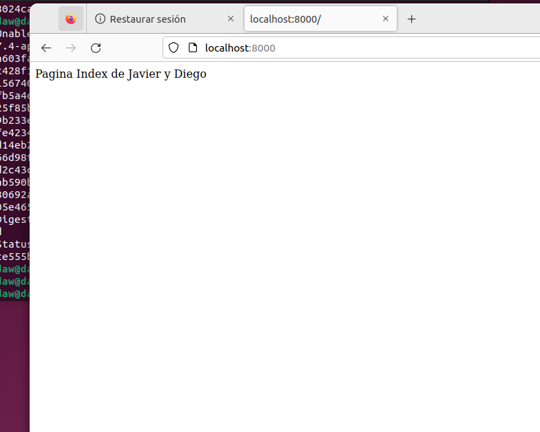
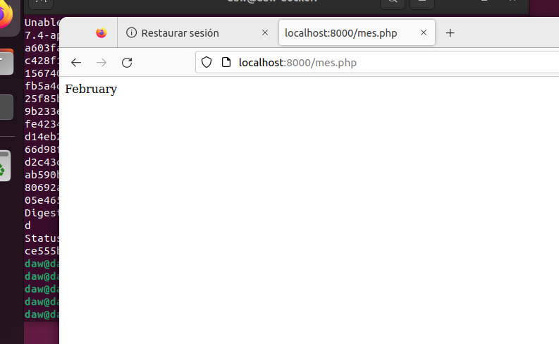
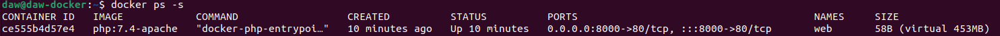
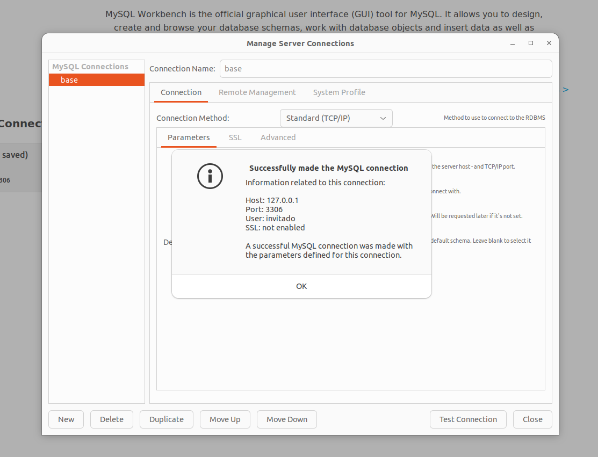
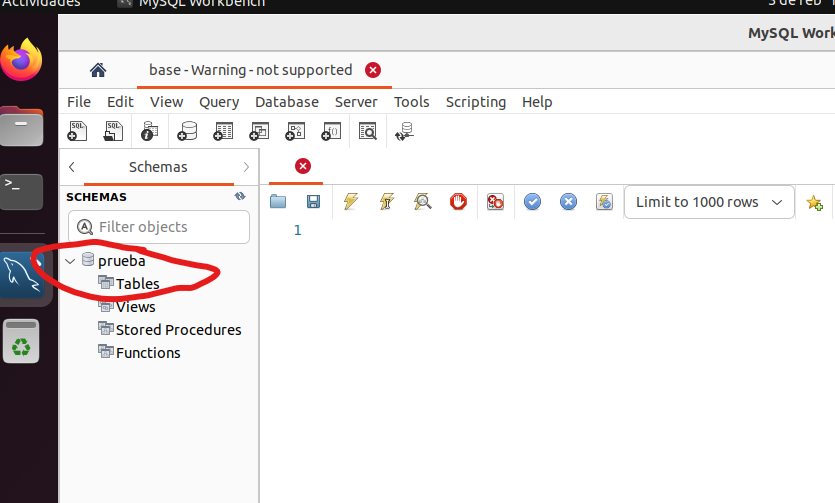
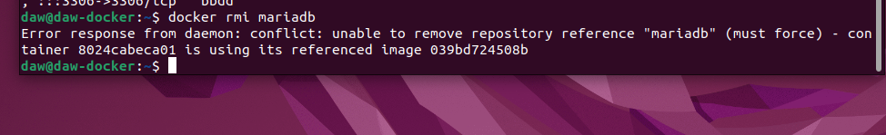

# Ejercicio 1 - trabajo con imágenes

[TOC]


## Servidor web

### Arranca un contenedor que ejecute una instancia de la imagen php:7.4-apache , que se llame web y que sea accesible desde un navegador en el puerto 8000.

```bash
daw@daw-docker:~$ docker run --name web -p 8000:80 -d php:7.4-apache
```

### Colocar en el directorio raíz del servicio web( /var/www/html ) un sitio web donde figure el nombre de los componentes del grupo.

```bash
daw@daw-docker:~$ echo "Pagina Index de Javier y Diego" > index.html
daw@daw-docker:~$ docker cp index.html web:/var/www/html/index.html
```



### Colocar en ese mismo directorio raíz un archivo llamado mes.php que muestre el nombre del mes actual. 

```bash
daw@daw-docker:~$ echo "<?php echo date('F'); ?>" > mes.php
daw@daw-docker:~$ docker cp mes.php web:/var/www/html/mes.php
```

### Ver la salida del script en el navegador



### Borrar el contenedor

```bash
daw@daw-docker:~$ docker rm -f web
web
```


## Servidor de base de datos

### Arrancar un contenedor que se llame bbdd y que ejecute una instancia de la imagen mariadb para que sea accesible desde el puerto 3306. 

```bash
daw@daw-docker:~$ docker run --name bbdd -p 3306:3306 -e MYSQL_ROOT_PASSWORD=password -d mariadb
```

### Antes de arrancarlo visitar la página del contenedor en Docker Hub y establecer las variables de entorno necesarias para que: 

- La contraseña de root sea root . 

- Crear una base de datos automáticamente al arrancar que se llame prueba . 

- Crear el usuario invitado con la contraseña invitado . 

```bash
docker run --name bbdd -p 3306:3306 -e MYSQL_ROOT_PASSWORD=root 
-e MYSQL_DATABASE=prueba 
-e MYSQL_USER=invitado 
-e MYSQL_PASSWORD=invitado 
-d mariadb
```


## Entregar un documento con los siguientes pantallazos, y los comandos empleados para resolver cada apartado: 

- Pantallazo que desde el navegador muestre el fichero index.html . 


- Pantallazo que desde un navegador muestre la salida del script mes.php 

  

- Pantallazo donde se vea el tamaño del contenedor web después de crear los dos ficheros.

  ```bash
  daw@daw-docker:~$ docker ps -s
  ```

  

  

- Pantallazo donde desde un cliente de base de datos (instalado en tu ordenador) se pueda observar que hemos podido conectarnos al servidor de base de datos con el usuario creado y que se ha creado la base de datos prueba ( show databases ). El acceso se debe realizar desde el ordenador que tenéis instalado docker, no hay que acceder desde dentro del contenedor, es decir, no usar docker exec . 

  

  

  

- Pantallazo donde se comprueba que no se puede borrar la imagen mariadb mientras el contenedor bbdd está creado.

  

## Webgrafía utilizada

#### https://www.ingenieriazeros.com/2020/06/solucion-workbench-ubuntu-AppArmor.html

#### https://hub.docker.com/_/mariadb


