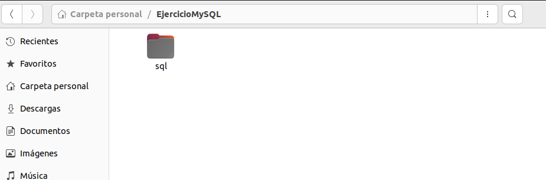
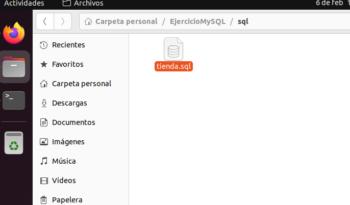
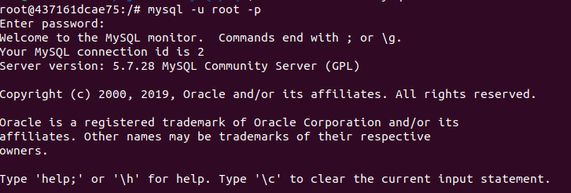
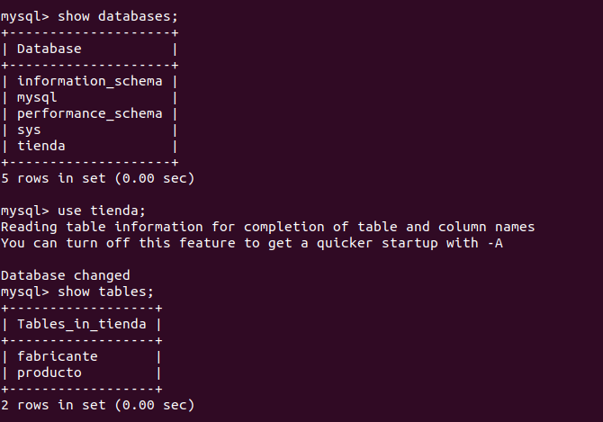
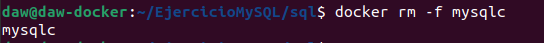
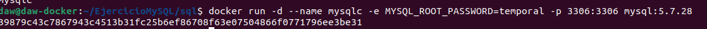
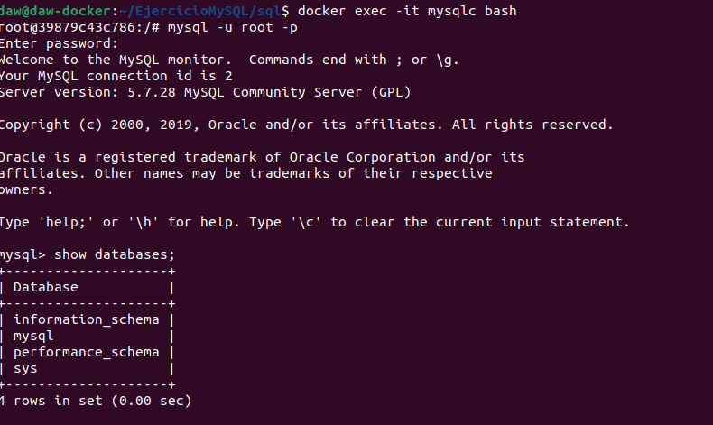

# Ejercicio 2 - almacenamiento - Mysql - opción 2

 

[TOC]


La imagen oficial de mysql, ejecuta los archivos con extensión .sh, .sql y .sql.gz que se encuentren en el directorio /docker-entrypoint-initdb.d . Estos archivos serán ejecutados por orden alfabético. 

Gracias a esta funcionalidad es muy sencillo importar una base de datos en nuestro contenedor de forma automática con un solo comando. 

Lo único que necesitamos es crear un nuevo directorio en nuestro directorio de trabajo que contenga los scripts SQL que queremos importar en el contenedor. Este directorio local con los scripts SQL tendremos que montarlo sobre el directorio /docker-entrypoint-initdb.d del sistema de ficheros del contenedor. 

### **1.Crea un nuevo directorio con el nombre sql en tu directorio de trabajo.** 




### **2.Crea un archivo con el nombre tienda.sql y guárdalo en el directorio sql.** 




### **3.Instancia un nuevo contenedor montando un volumen entre el directorio sql de tu directorio local del trabajo con el directorio /docker-entrypoint-initdb.d del sistema de ficheros del contenedor.** 

El comando será algo como esto [ojo, está incompleto...] 

```mysql
$ docker run -d \
--rm \
--name mysqlc \
-e [ variable de entorno con la password del usuario root ]
-p [ puerto usado por el servidor de BD ] \
-v mysql_data:/var/lib/mysql \
-v "$PWD/sql":/docker-entrypoint-initdb.d \ [ tendrás que trabajar con la
expresión entre comillas ... ]
mysql:5.7.28

```


**Ejecutamos el siguiente comando:**

```
docker run -d --name mysqlc -e MYSQL_ROOT_PASSWORD=temporal -p 3306:3306 -v /home/daw/EjercicioMySQL/sql:/docker-entrypoint-initdb.d mysql:5.7.28
```


### **1.Abre un terminal en el contenedor que acabas de crear para interaccionar con él.** 


### **2.Una vez dentro del contenedor inicia una conexión a la consola de MySQL con mysql -u root -p.**




### **3.Comprueba que la base de datos tienda existe y tiene datos.** 




### **4.Borra el contenedor y crea otro sin utilizar docker-entrypoint-initdb.d** 






### **5.Entra en la consola MySQL y muestra los datos de la tabla fabricantes.** 

No existe esta tabla, ya que no tenemos el volumen compartido y por lo tanto no ejecuta el script *tiendas.sql*



Documenta todo el proceso. 


**Fichero tienda.sql**

```mysql
DROP DATABASE IF EXISTS tienda;
CREATE DATABASE tienda CHARSET utf8mb4;
USE tienda;
CREATE TABLE fabricante (
codigo INT UNSIGNED AUTO_INCREMENT PRIMARY KEY,
nombre VARCHAR(100) NOT NULL
);
CREATE TABLE producto (
codigo INT UNSIGNED AUTO_INCREMENT PRIMARY KEY,
nombre VARCHAR(100) NOT NULL,
precio DOUBLE NOT NULL,
codigo_fabricante INT UNSIGNED NOT NULL,
FOREIGN KEY (codigo_fabricante) REFERENCES fabricante(codigo)
);
INSERT INTO fabricante VALUES(1, 'Asus');
INSERT INTO fabricante VALUES(2, 'Lenovo');
INSERT INTO fabricante VALUES(3, 'Hewlett-Packard');
INSERT INTO fabricante VALUES(4, 'Samsung');
INSERT INTO fabricante VALUES(5, 'Seagate');
INSERT INTO fabricante VALUES(6, 'Crucial');
INSERT INTO fabricante VALUES(7, 'Gigabyte');
INSERT INTO fabricante VALUES(8, 'Huawei');
INSERT INTO fabricante VALUES(9, 'Xiaomi');
INSERT INTO producto VALUES(1, 'Disco duro SATA3 1TB', 86.99, 5);
INSERT INTO producto VALUES(2, 'Memoria RAM DDR4 8GB', 120, 6);
INSERT INTO producto VALUES(3, 'Disco SSD 1 TB', 150.99, 4);
INSERT INTO producto VALUES(4, 'GeForce GTX 1050Ti', 185, 7);
INSERT INTO producto VALUES(5, 'GeForce GTX 1080 Xtreme', 755, 6);
INSERT INTO producto VALUES(6, 'Monitor 24 LED Full HD', 202, 1);
INSERT INTO producto VALUES(7, 'Monitor 27 LED Full HD', 245.99, 1);
INSERT INTO producto VALUES(8, 'Portátil Yoga 520', 559, 2);
INSERT INTO producto VALUES(9, 'Portátil Ideapd 320', 444, 2);
INSERT INTO producto VALUES(10, 'Impresora HP Deskjet 3720', 59.99, 3);
INSERT INTO producto VALUES(11, 'Impresora HP Laserjet Pro M26nw', 180, 3);
```


### 6.**Webgrafía**.

- DockerHub oficial:

  https://hub.docker.com/_/mysql

- Platzi:

  https://platzi.com/tutoriales/1432-docker/3268-como-crear-un-contenedor-con-docker-mysql-y-persistir-la-informacion/
