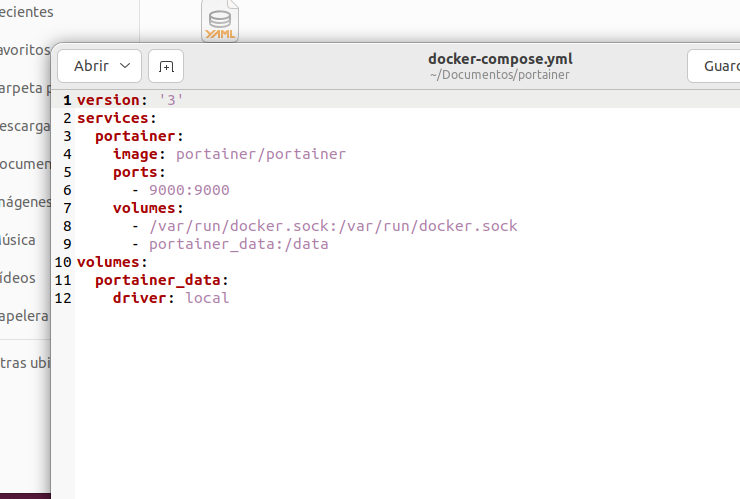

# Ejercicio 2 - almacenamiento - Portainer - opción 1


[TOC]

## Utilizaza una imagen de 'Portainer' para gestionar Docker. Debes crear un volumen para la persistencia de los datos.

Creamos el archivo dockercompose yml.




Lo lanzamos.

```bash
daw@daw-docker:~/Documentos/portainer$ docker-compose up -d
```

## 


## Muestra contenedores activos, para un contenedor, borra un contenedor


## Muestra alguna operación con redes Docker


## Muestra alguna operación con volúmenes Docker


## Webgrafia

Instalacion con docker compose

https://earthly.dev/blog/portainer-for-dcm/
