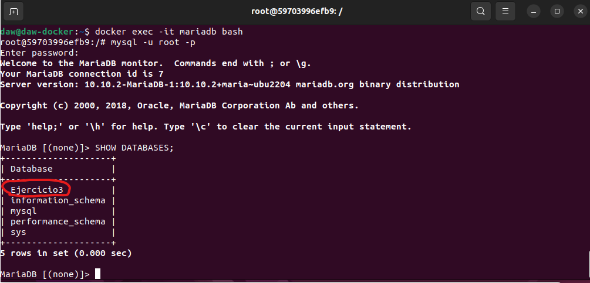

# Ejercicio 3 -Redes


[TOC]

### Despliegue de contenedores en red: Adminer y MariaDB.

##### 1.Crea una red bridge redbd.

Creamos la red con el siguiente comando:

```bash
docker network create redbd
```

 


##### 2.Crea un contenedor con una imagen de mariaDB que estará en la red redbd . Este contenedor se ejecutará en segundo plano, y será accesible a través del puerto 3306. (Es necesario definir la contraseña del usuario root y un volumen de datos persistente).

Creamos contenedor mariadb con contraseña root *temporal* y un volumen de datos persistente:

```bash
docker run -d --name mariadb --network redbd -e MYSQL_ROOT_PASSWORD=root_password -v mariadb_data:/var/lib/mysql -p 3306:3306 mariadb
```


##### 3.Crear un contenedor con Adminer que se pueda conectar al contenedor de la BD

Creamos contenedor adminer y usamos la misma red para que se pueda conectar a la BD: 

```
docker run -d --name adminer --network redbd -p 8080:8080 adminer
```


##### 4.Comprobar que el contenedor Adminer puede conectar con el contenedor mysql abriendo un navegador web y accediendo a la URL: http://localhost:8080 

Nos conectamos con las credenciales:

**Entregar los siguientes pantallazos y los comandos empleados para resolver cada apartado:**

- **Pantallazo donde se vea la creación de una BD con la interfaz web Adminer** 

  Creamos BD Ejercicio3:

  

  

- **Pantallazo donde se entre a la consola del servidor web en modo texto y se compruebe que se ha creado la BD** 

  Accedemos al servidor en modo texto:

  ```
  docker exec -it mariadb bash
  ```

  Una vez dentro, accedemos a nuestra base de datos con las credenciales de root:

  ```
  mysql -u root -p
  ```

  Ahora comprobamos las bases de datos de nuestro servidor:

  ```
  SHOW DATABASES;
  ```

  Comprobamos que la base de datos Ejercicio3 se ha creado correctamente:

  

  

- **Borrar los contenedores la red y los volúmenes utilizados**

  Borramos todos los contenedores con el siguiente comando:

  ```
  docker rm -f $(docker ps -aq)
  ```

  Y borramos la red:

  ```
  docker network rm redbd
  ```

  

  

  

​		

##### 5.Webgrafía

- Imagen oficial de AdMiner en DockerHub:

​		https://hub.docker.com/_/adminer/

- Imagen oficial MariaDB en DockerHub:

  https://hub.docker.com/_/mariadb


