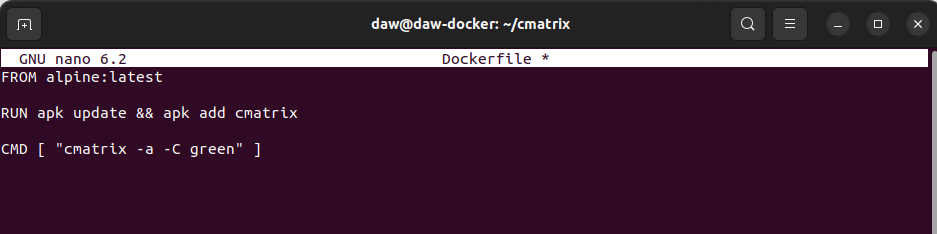
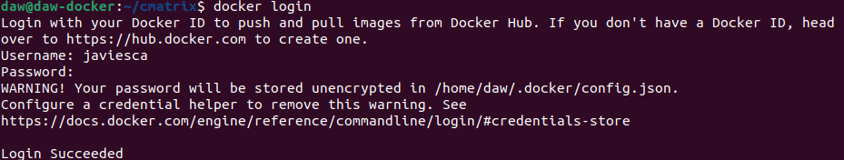

# Ejercicio 4 - Docker Compose


**Desplegar la aplicación cmatrix utilizando docker-compose.** 

**Entregar los siguientes pantallazos y lo comandos empleados para resolver el ejercicio:** 

Crearemos un contenedor usando la aplicación cmatrix, para ello generamos un archivo Dockerfile en nuestro directorio de trabajo:



Ahora construimos el contenedor:

```
docker build -t cmatrix .
```

Ahora subiremos ese contenedor a nuestra cuenta de DockerHub, para ello nos logueamos:

```
docker login
```



Ponemos una etiqueta a nuestro contenedor, lo vinculamos a nuestra cuenta y lo subimos a DockerHub:

```
docker tag cmatrix javiesca/cmatrix:latest
```

```
docker push javiesca/cmatrix:latest
```


Una vez hecha la imagen y subida a nuestra DockerHub continuamos con el ejercicio.

- **Pantallazo donde se vea el fichero *docker-compose.yaml*.** 

  

- Pantallazo donde se vea la aplicación funcionando. 

- Se valorará conseguir el efecto **Greenrain**. 

- Explicar brevemente cómo funciona esta aplicación.


