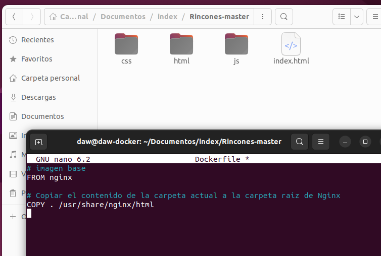
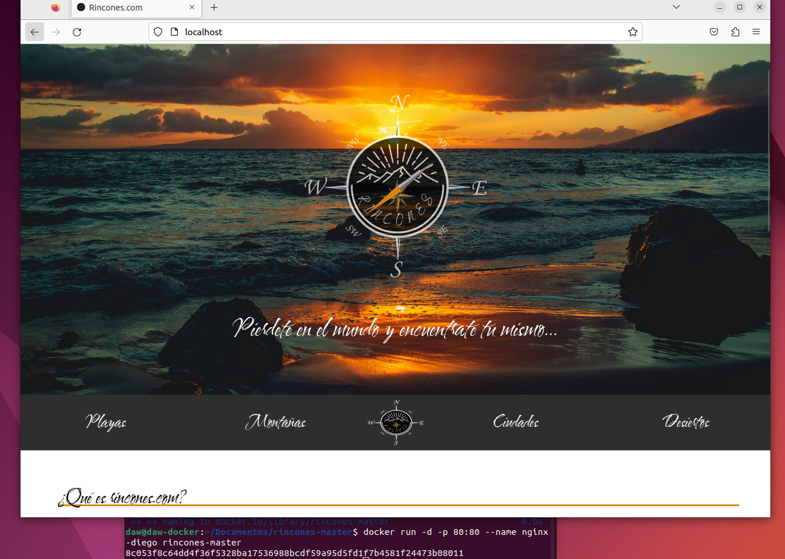
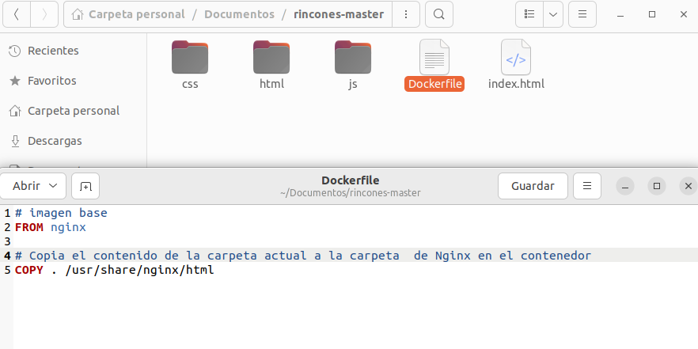
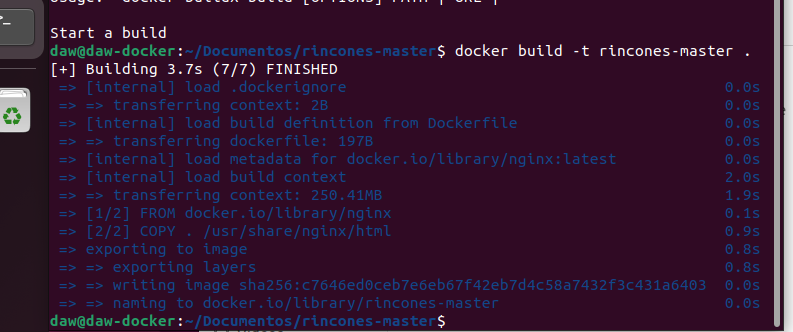
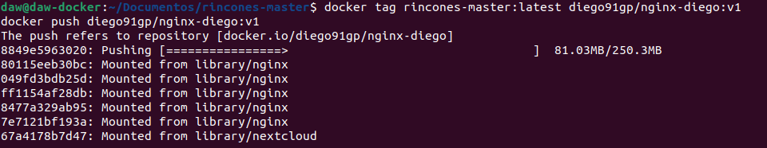
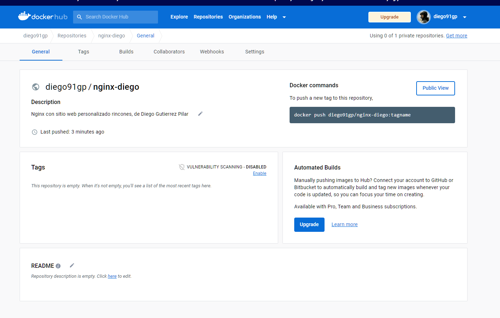

# Ejercicio 5 - imagen con Dockerfile 

[TOC]

### 1. Crear una imagen con un servidor web que sirva un sitio web Basar la imagen en nginx o apache.

###  2. Desplegar una plantilla, o un trabajo de clase, que tenga, al menos, un index.html y una carpeta para estilos, imágenes, etc. 

###  3. Deberás entregar los siguientes pantallazos y los comandos empleados para resolver cada apartado: 

- Pantallazo/bloque de código con el Dockerfile 

  

  

- Pantallazo donde se vea el comando que crea la nueva imagen. 

  

- Pantallazo donde se vea la imagen subida a tu cuenta de Docker Hub

  

  

  

  

- Pantallazo donde se vea la bajada de la imagen - por parte de otra persona del grupo - y la creación de un contenedor. 

  

- Pantallazo donde se ve el acceso al navegador con el sitio servido

  

### Webgrafía

https://hub.docker.com/_/nginx

https://aulasoftwarelibre.github.io/taller-de-docker/dockerfile/

