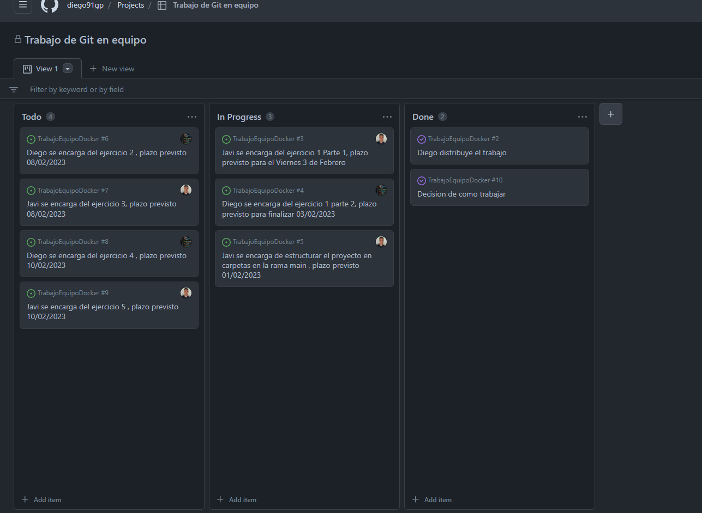
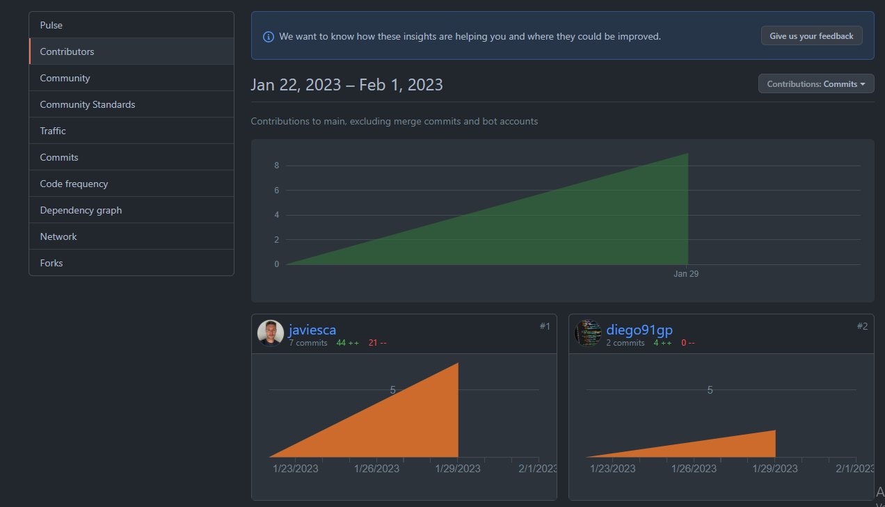
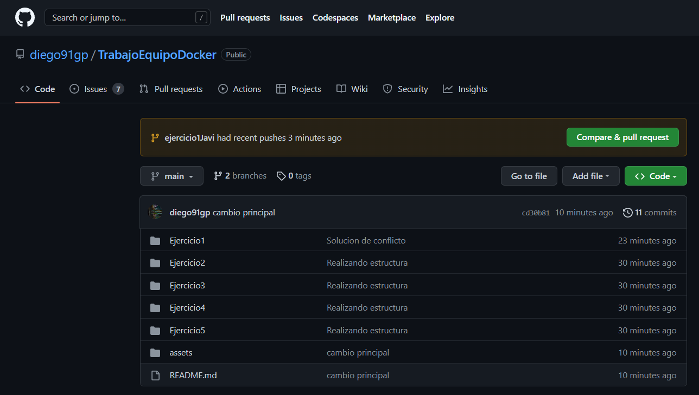
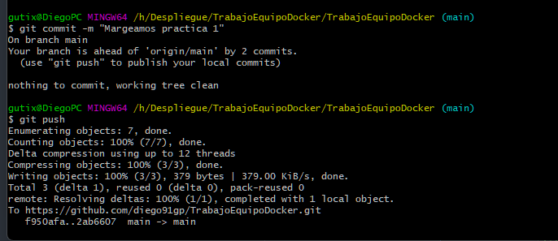
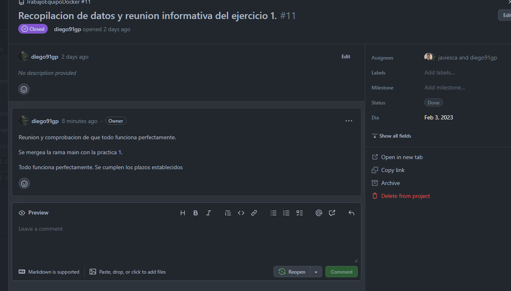
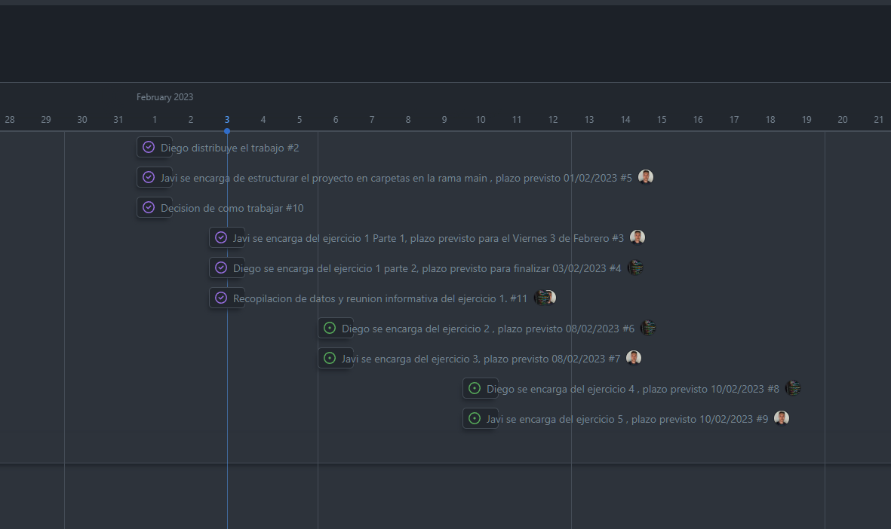

# Trabajo Equipo Docker Javi-Diego
Trabajo en equipo de la tarea evaluable Docker para despliegue.

### <a href="https://github.com/users/diego91gp/projects/1/views/1">RoadMap de trabajo</a>

## Enlaces a los Ejercicios Finalizados
<ul>
  <li><a href="Ejercicio1/Diego">Ejercicio 1</a></li>
</ul>

## Dia 1 Repartimos el trabajo

## Dia 1 Decidimos trabajar como colaboradores

## Dia 1 Creamos la estructura de trabajo en Git

## Dia 2 Mergeamos el Primer ejercicio con la rama main

## Dia 2 Reunión para comprobar funcionalidades

## Dia 2 todo funciona y se cumplen los plazos

### Autor: Diego Gutiérrez Pilar
### Autor: Javier Viesca

