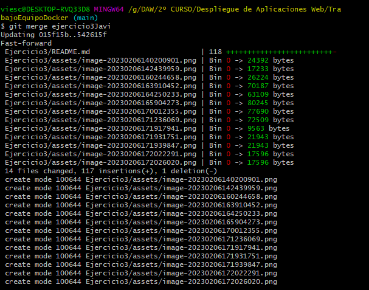
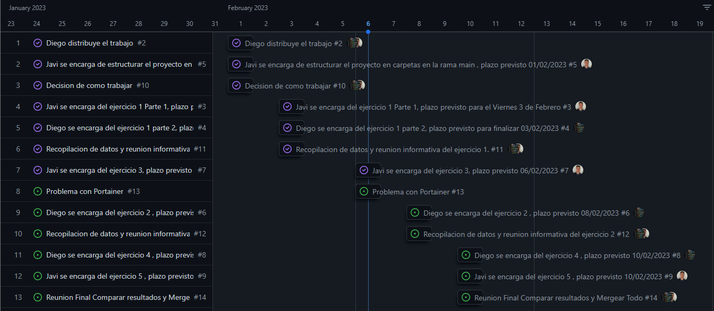
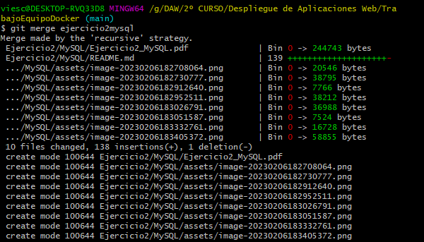
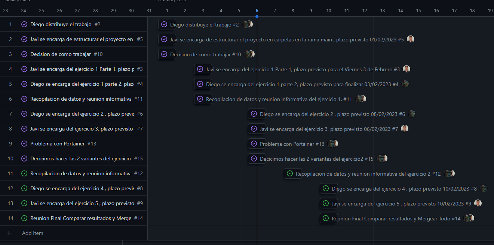
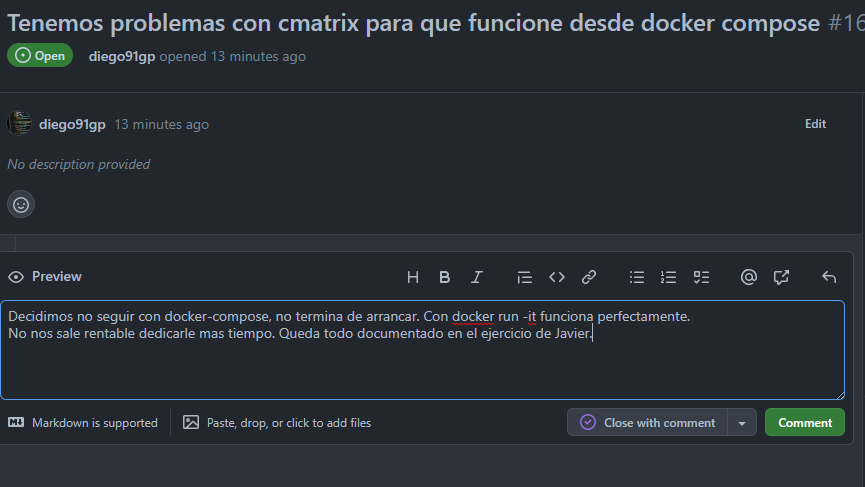
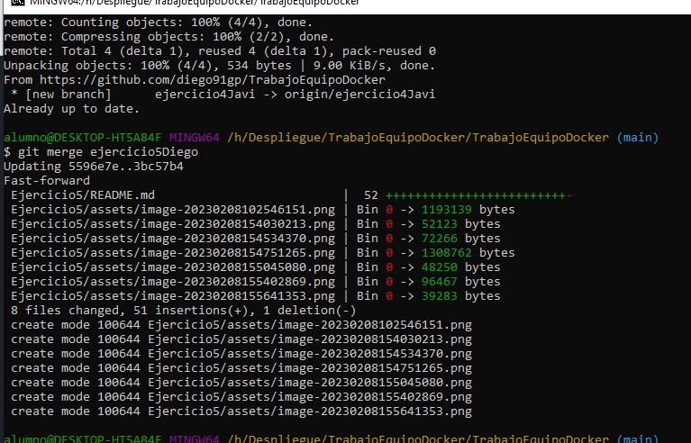

# Trabajo Equipo Docker Javi-Diego

[TOC]

Trabajo en equipo de la tarea evaluable Docker para despliegue.

## <a href="https://github.com/users/diego91gp/projects/1/views/1">RoadMap de trabajo</a>

## Enlaces a los Ejercicios Finalizados
<ul>
  <li><a href="Ejercicio1/Diego">Ejercicio 1</a></li>
  <li><a href="Ejercicio2/">Ejercicio 2</a>
  	<ul><a href="Ejercicio2/Portainer">Portainer</a></ul>
    <ul><a href="Ejercicio2/MySQL">MySQL</a></ul> 
  </li>
  <li><a href="Ejercicio3/">Ejercicio 3</a></li>
   <li><a href="Ejercicio4/">Ejercicio 4</a></li>
    <li><a href="Ejercicio5/">Ejercicio 5</a></li>
</ul>

### Dia 1 Repartimos el trabajo

### Dia 1 Decidimos trabajar como colaboradores

### Dia 1 Creamos la estructura de trabajo en Git

### Dia 2 Mergeamos el Primer ejercicio con la rama main

### Dia 2 Reunión para comprobar funcionalidades

### Dia 2 todo funciona y se cumplen los plazos

### Dia 3. Mergeamos el Ejercicio 3 a la rama principal y completamos el Issue.

### Dia 3. Mergeamos el Ejercicio 2 a la rama principal y completamos el Issue.

Decidimos hacer las 2 variantes del Ejercicio 2. Diego se ocupa de la parte de Portainer y Javi de la parte de MySQL.

### Dia 4. Decidimos dejar a un lado la ejecución de cmatrix en docker-compose, no arranca y no nos sale rentable dedicarle mas tiempo.

### Dia 4. Finalizamos los Ejercicios y Mergeamos.

### Dia 4. Reunión Final para comprobar las imagenes creadas en el ejercicio 5 y todo funciona perfectamente.

### Dia 4. Final de Proyecto.

## Tiempo total de proyecto y observaciones

- Tiempo estimado 8 horas ----- Tiempo real 7 horas.
- Trabajando en  equipo trabajamos mas rápido y nos ayudamos a resolver problemas.
- Teniendo un roadmap organizado desde el primer día ayuda a distribuir el trabajo y mejorar la productividad.

### Autores: Diego Gutiérrez Pilar y  Javier Viesca

